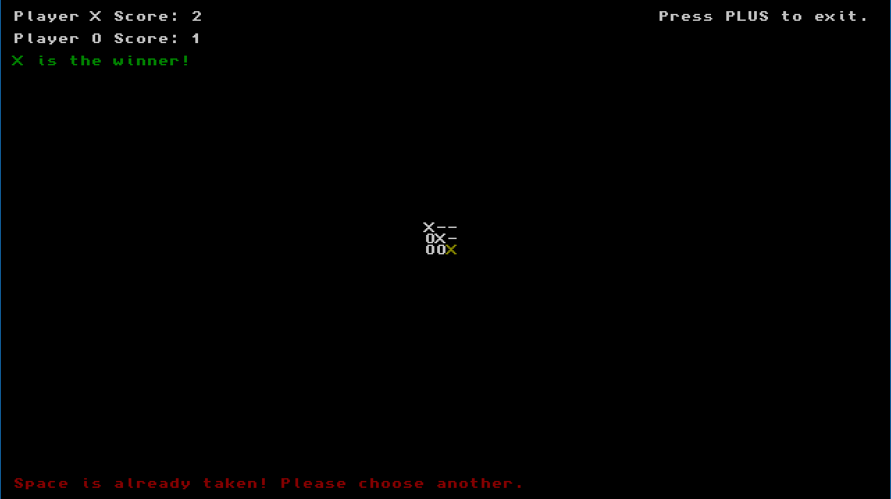

# TicTacToe - Nintendo Switch

A very basic implementation of TicTacToe for the Nintendo Switch, made as a test to learn homebrew development.

## Compiling

Ensure you have DevKitPro installed and run the `make` command at the project root to compile the code.
